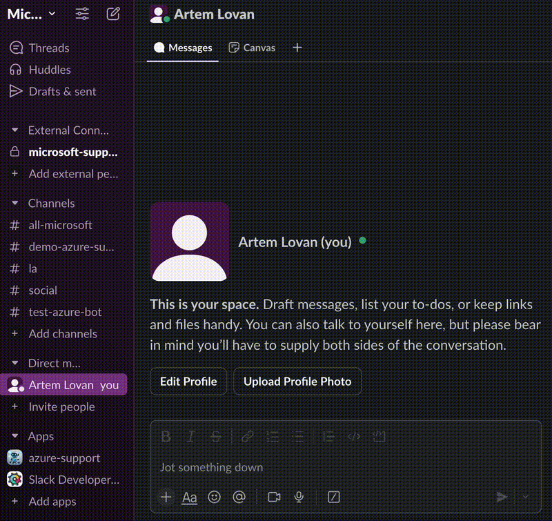

# Azure Support Slack Bot

A sample project for integrating Azure support ticket management directly into Slack. This bot enables users to open, track, and manage Azure support tickets without leaving their Slack workspace.



---

## Table of Contents

1. [Overview](#overview)
2. [Features](#features)
3. [Prerequisites](#prerequisites)
4. [Setup Guide](#setup-guide)
    - [1. Create a Slack App](#1-create-a-slack-app)
    - [2. Run ngrok](#2-run-ngrok)
    - [3. Update Slack App Manifest](#3-update-slack-app-manifest)
    - [4. Configure Environment Variables](#4-configure-environment-variables)
    - [5. Run the App (Locally or with Docker)](#5-run-the-app-locally-or-with-docker)
5. [Using the Bot](#using-the-bot)
6. [Troubleshooting](#troubleshooting)
7. [License](#license)
8. [Contributing](#contributing)

---

## Overview

Many teams use Slack as their primary collaboration platform. Managing Azure support tickets typically requires switching between Slack and the Azure Portal, which can disrupt workflow. This repository provides a practical starting point for integrating Azure support workflows into Slack, making support management more accessible and efficient.

---

## Features

- Open Azure support tickets directly from Slack
- Track and manage ticket status within Slack *(planned)*
- Supports both direct messages and channels *(planned)*
- Infrastructure code to deploy to Azure *(planned)*

---

## Prerequisites

- **Slack**: Permissions to create, configure, and install a Slack app
- **Azure**: User or [service principal](https://learn.microsoft.com/en-us/azure/devops/integrate/get-started/authentication/service-principal-managed-identity?view=azure-devops) with the following roles:
    - [Support Request Contributor](https://learn.microsoft.com/en-us/azure/role-based-access-control/built-in-roles/management-and-governance#support-request-contributor) (manage support tickets)
    - [Reader](https://learn.microsoft.com/en-us/azure/role-based-access-control/built-in-roles/general#reader) (view/list all resources)
- [Python 3.13](https://www.python.org/downloads/) and/or [Docker](https://www.docker.com/products/docker-desktop/)
- [Ngrok](https://ngrok.com/) (for local development/testing)
- [Azure CLI](https://learn.microsoft.com/en-us/cli/azure/install-azure-cli?view=azure-cli-latest)  
  *Note: The app relies on Azure CLI for credentials. See [DefaultAzureCredential](https://learn.microsoft.com/en-us/python/api/azure-identity/azure.identity.defaultazurecredential?view=azure-python) for alternatives.*

---

## Setup Guide

### 1. Create a Slack App

1. Go to the [Slack API Apps page](https://api.slack.com/apps/)
2. Click **Create New App**
3. Select **From a manifest**
4. In **Step 2 of 3**, choose **YAML** and paste the contents of `slack_app_manifest.yaml`
5. Click **Next** and **Create**
6. On the **Basic Information** page, copy the **Signing Secret** for later

### 2. Run ngrok

Slack requires a publicly accessible endpoint for event delivery. Use ngrok to tunnel your local server:

```sh
ngrok http http://localhost:5000
```

Copy the **Forwarding** URL for use in the Slack app manifest.

### 3. Update Slack App Manifest

1. In your Slack app settings, go to **App Manifest**
2. Replace all instances of `YOUR-DOMAIN-NAME` with your ngrok forwarding domain (e.g., `https://qwert123456.ngrok-free.app`). The complete URL should look similar to `https://qwert123456.ngrok-free.app/slack/events`
3. Click **Save Changes**
4. Go to **Install App** and install it to your workspace
5. Copy the **Bot User OAuth Token** for later to configure the app.

### 4. Configure Environment Variables

1. Copy `.env-example` to `.env`
2. Set the following variables in `.env`:
    - `SLACK_SIGNING_SECRET` (from Slack app)
    - `SLACK_BOT_TOKEN` (Bot User OAuth Token)

### 5. Run the App (Locally or with Docker)

#### **Locally (Python)**

Install dependencies:

```sh
pip install -r requirements.txt
```

Run the app:

```sh
python ./app.py
```

#### **With Docker**

Build the Docker image:

```sh
docker build -t azure-support-slack-bot .
```

Run the container (using your local Azure credentials):

**Note:**  
You can provide `SLACK_BOT_TOKEN` and `SLACK_SIGNING_SECRET` as environment variables when running the Docker container, even if these values are already set in your `.env` file. This makes it easy to override credentials at runtime without modifying or copying the `.env` file into the image, and avoids the need to rebuild the Docker image for configuration changes.

```sh
docker run -p 5000:5000 --rm --name azure-support-bot \
  -e SLACK_BOT_TOKEN=your-slack-bot-token-here \
  -e SLACK_SIGNING_SECRET=your-slack-signing-secret-here \
  -v $HOME/.azure:/root/.azure \
  azure-support-slack-bot
```

---

## Using the Bot

- **Add the bot to your desired Slack channels** (if you want it to work outside of DMs)
- Use the `/azure-support` shortcut in Slack to open the support request form

---

## Troubleshooting

- **Bot not responding?**  
  - Ensure ngrok is running

## License

This project is licensed under the MIT License. See the [LICENSE](LICENSE) file for details.

## Contributing

Contributions are welcome! Please see [CONTRIBUTING.md](CONTRIBUTING.md) for guidelines.