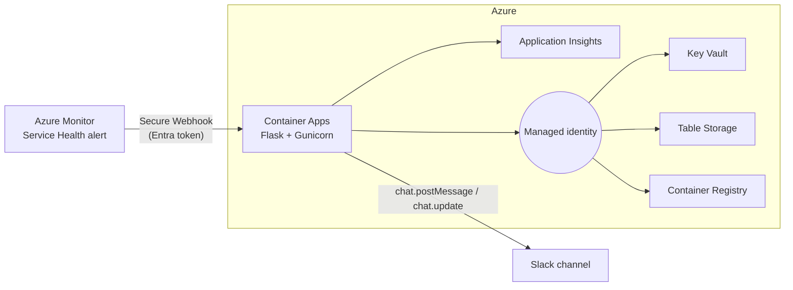

# Bring Azure Service Health incidents into Slack with Container Apps

Most startups run incident response in Slack. Azure Service Health
notifications, however, usually land in the Azure portal or in an email inbox.
When something breaks at 2 a.m., the on-call engineer ends up asking in a
channel: "Is Azure down, or is it us?"

This post walks through a small open-source service that answers that question
where the team already is. It posts every Azure Service Health incident into the
right Slack channel as a single message that updates in place, from *Active*
through *Updated* to *Resolved*. The code, infrastructure as code, and
deployment scripts are on GitHub:
[ricmmartins/azure-support-slack-bot](https://github.com/ricmmartins/azure-support-slack-bot).

## What it does

An Azure Monitor Activity Log Alert sends Service Health events (service issues,
planned maintenance, health advisories, and security advisories) to the service.
For each event the service:

- **Routes** the incident to a channel using rules for subscription, service,
  and region, with a default channel for everything else.
- **Posts one root message per incident** with the status, impacted services
  and regions, and a link to the incident in the Azure portal.
- **Updates that same message** as Microsoft publishes new updates, so the
  incident history and the team's discussion stay in one thread.

It is notification-only. The Slack app needs a single bot scope, `chat:write`,
and Slack never calls back into Azure.

## Architecture



The service is a small Python Flask app running in one container on
[Azure Container Apps](https://learn.microsoft.com/azure/container-apps/overview).

| Concern | Azure service |
|---|---|
| Compute | Azure Container Apps |
| Images | Azure Container Registry, pulled with managed identity |
| Secrets | Azure Key Vault, exposed to the app as Key Vault secret references |
| Incident state | Azure Table Storage, accessed with RBAC (shared keys disabled) |
| Identity | One user-assigned managed identity for every Azure call |
| Observability | Workspace-based Application Insights via OpenTelemetry |
| Alerts | Activity Log Alert and Action Group with a Secure Webhook |

The managed identity holds no subscription-wide roles. It reads its own Key
Vault secrets, uses its own Storage account, and pulls from its own registry.

Everything is described in Bicep and deployed with the
[Azure Developer CLI](https://learn.microsoft.com/azure/developer/azure-developer-cli/overview):

```sh
azd env new
azd env set SLACK_BOT_TOKEN "<xoxb-token>"
azd env set SERVICE_HEALTH_ROUTES_JSON '{"default_channel_id":"C0123456789","rules":[]}'
azd provision
azd deploy
azd provision
```

A pre-provision hook creates the Microsoft Entra app registration that protects
the webhook. The second `azd provision` switches the Container App from the
placeholder image to the real one and turns on health probes.

## Accepting calls only from Azure Monitor

The webhook is a public HTTPS endpoint, so it has to reject anything that is
not Azure Monitor. Action Groups support a
[Secure Webhook](https://learn.microsoft.com/azure/azure-monitor/alerts/action-groups#secure-webhook)
that attaches a Microsoft Entra token to every call. The deployment registers an
API app with an `ActionGroupsSecureWebhook` app role and assigns that role to
the Azure Monitor service principal.

Container Apps
[built-in authentication](https://learn.microsoft.com/azure/container-apps/authentication)
validates the token signature and issuer, then forwards the caller's claims in
the `X-MS-CLIENT-PRINCIPAL` header. Container Apps strips any copy of that
header sent by a client, so the app can trust it. The app then checks three
things itself: the caller application ID belongs to Azure Monitor, the token
carries the app role, and the audience matches the API.

Two lessons from production hardening:

1. **Accept both audience formats.** The Secure Webhook app is configured for
   Entra v2 access tokens, where `aud` is the client ID GUID rather than the
   `api://` identifier URI. Both the platform and the application accept both.
2. **Fail closed.** If `APP_ENV` is missing, the app assumes production and
   refuses to serve the webhook without an expected audience. Only an explicit
   `APP_ENV=development` disables the identity check for local testing.

## At-least-once delivery without duplicate Slack messages

Action Groups retry webhooks that return 408, 429, 503, or 504, and several
container replicas may receive related events at the same time. The service
turns that into "one Slack message per incident, updated in order".

Each incident is keyed by subscription and a hash of the Service Health tracking
ID. The Table Storage entity holds the Slack channel, the message timestamp, the
last processed update, and a short lease. Every write uses an ETag condition,
so two replicas cannot both claim the same incident. The flow is:

1. Claim the incident with a conditional insert or update.
2. Skip identical retries and older updates, and return 200 so Azure Monitor
   stops retrying.
3. Post or update the Slack message.
4. Persist the Slack timestamp and release the lease.

Transient Slack or Storage errors return 503 so the Action Group retries.
Invalid payloads and permanent Slack errors, such as a channel the bot was
never invited to, return 4xx so the platform does not retry forever. If someone
deletes the tracked Slack message, the next update posts a new root message and
stores its timestamp instead of failing.

There is still a small window between a successful first post and saving its
timestamp. A crash in that window can produce a duplicate message on retry.
Removing it completely would need a transactional outbox, which is more than
this workload needs. The README documents how to reconcile it.

## Operating it

Application Insights collects requests, dependency calls to Slack and Table
Storage, logs, and custom counters. A good first alert is a sustained rate of
503 responses on `/api/service-health`, which means Slack or Storage is failing
and Azure Monitor is retrying. The repository includes starter Kusto queries.

The project has automated tests covering payload parsing, routing, identity
checks, concurrency and retries, and Slack rendering. A GitHub Actions workflow
runs lint, tests, a dependency audit, and a container build with a smoke test
on every push.

## Before you run it in production

Know the trade-offs before adopting it:

- Key Vault and Storage use RBAC but keep public network access. Add private
  endpoints and VNet integration if your policies require network isolation.
- The Activity Log Alert is scoped to one subscription. Deploy the included
  alert module in each additional subscription you want to monitor.
- Key Vault purge protection is on, so `azd down` leaves a soft-deleted vault
  for the retention period.

## Try it

Clone the repository, create the Slack app from the included manifest, invite
the bot to your incident channels, and deploy it to a test subscription with the
`azd` commands above. Issues and pull requests are welcome. If you are a startup
building on Azure, check out
[Microsoft for Startups](https://www.microsoft.com/startups) for credits,
technical guidance, and access to experts who can help you run workloads like
this with confidence.
