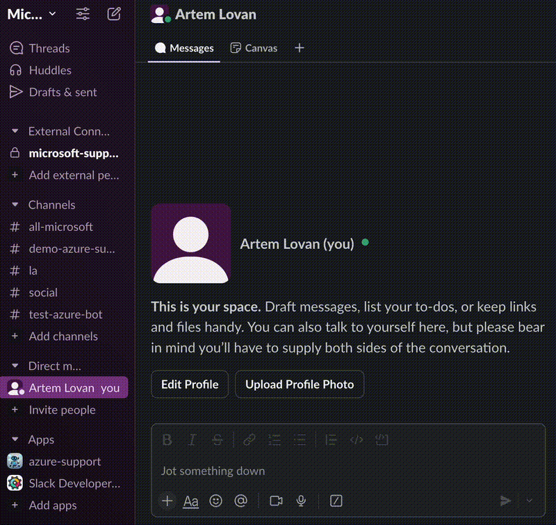
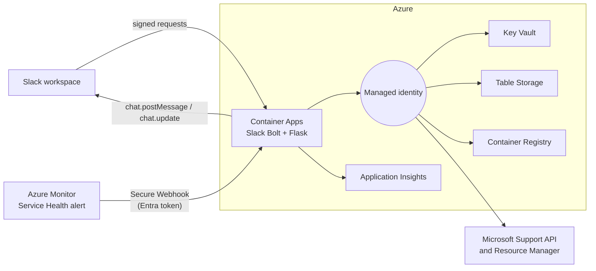

# Bring Azure Support and Service Health into Slack with Container Apps

Most startups do incident response in Slack. Azure support requests and
Service Health notifications, however, usually live in the Azure portal and
in email inboxes. When an engineer hits a platform issue at 2 a.m., the team
ends up switching between tools, copying resource IDs by hand, and asking in
a channel whether "Azure is down or is it us?"

This post walks through an open-source Slack app that closes that gap. It lets
engineers open an Azure support request from Slack in under a minute, and it
posts Azure Service Health incidents into the right channel as one message that
updates in place from *Active* to *Resolved*. The code, infrastructure as code,
and deployment scripts are on GitHub:
[ricmmartins/azure-support-slack-bot](https://github.com/ricmmartins/azure-support-slack-bot).



## What the bot does

**Open support requests without leaving Slack.** A `/azure-support` slash
command, a message shortcut, or a mention opens a modal. The engineer picks a
subscription, an Azure service, a problem classification, and the affected
resource. The option lists are populated live from the Azure Resource Manager
and Microsoft Support APIs, so they always reflect what the subscription
actually contains. On submit, the bot creates the ticket through the Microsoft
Support API and posts a summary with a direct portal link into the channel the
engineer chose. The team can follow up in that thread.

**Get Service Health incidents where the team already is.** An Azure Monitor
Activity Log Alert sends Service Health events to the bot. The bot routes each
incident to a channel based on subscription, service, and region rules, posts
one root message per incident, and edits that same message as Microsoft
publishes updates. Replies stay in the thread, so the incident history and the
team's discussion stay together.

## Architecture



The app is a Python service built with [Slack Bolt](https://slack.dev/bolt-python/)
and Flask, running in a single container on
[Azure Container Apps](https://learn.microsoft.com/azure/container-apps/overview).

| Concern | Azure service |
|---|---|
| Compute | Azure Container Apps |
| Images | Azure Container Registry, pulled with managed identity |
| Secrets | Azure Key Vault, exposed to the app as Key Vault secret references |
| Incident state | Azure Table Storage, accessed with RBAC (shared keys disabled) |
| Identity | One user-assigned managed identity for every Azure call |
| Observability | Workspace-based Application Insights via OpenTelemetry |
| Alerts | Activity Log Alert and Action Group with a Secure Webhook |

Everything is described in Bicep and deployed with the
[Azure Developer CLI](https://learn.microsoft.com/azure/developer/azure-developer-cli/overview):

```sh
azd env new
azd env set SLACK_BOT_TOKEN "<xoxb-token>"
azd env set SLACK_SIGNING_SECRET "<signing-secret>"
azd env set SERVICE_HEALTH_ROUTES_JSON '{"default_channel_id":"C0123456789","rules":[]}'
azd provision
azd deploy
azd provision
```

A pre-provision hook creates the Microsoft Entra app registration that protects
the webhook. The second `azd provision` switches the Container App from the
placeholder image to the real one and turns on health probes.

## Securing an endpoint that two very different callers use

The container exposes two public endpoints with different trust models:

- `POST /slack/events` is called by Slack. It is authenticated with Slack's
  request signature, which Bolt verifies.
- `POST /api/service-health` is called by Azure Monitor. It must only accept
  requests from the Action Group.

Action Groups support a
[Secure Webhook](https://learn.microsoft.com/azure/azure-monitor/alerts/action-groups#secure-webhook)
that attaches a Microsoft Entra token to every call. We register an API app with
an `ActionGroupsSecureWebhook` app role and assign that role to the Azure
Monitor service principal. Container Apps
[built-in authentication](https://learn.microsoft.com/azure/container-apps/authentication)
validates the token signature and issuer, then forwards the caller's claims in
the `X-MS-CLIENT-PRINCIPAL` header. Container Apps strips any copy of that
header sent by a client, so the app can trust it. The app then checks three
things itself: the caller application ID belongs to Azure Monitor, the token
carries the app role, and the audience matches our API.

Built-in authentication runs in `AllowAnonymous` mode so that Slack traffic
still reaches Bolt, and the application enforces identity only on the webhook
route. Two lessons from production hardening:

1. **Accept both audience formats.** The Secure Webhook app is configured for
   Entra v2 access tokens, where `aud` is the client ID GUID rather than the
   `api://` identifier URI. Both the platform and the application accept both.
2. **Fail closed.** If `APP_ENV` is missing, the app assumes production and
   refuses to serve the webhook without an expected audience. Only an explicit
   `APP_ENV=development` disables the identity check for local testing.

## At-least-once delivery without duplicate Slack messages

Action Groups retry webhooks that return 408, 429, 503, or 504, and several
container replicas may receive related events at the same time. The bot needs
to turn that into "one Slack message per incident, updated in order".

Each incident is keyed by subscription and a hash of the Service Health tracking
ID. The Table Storage entity holds the Slack channel, the message timestamp, the
last processed update, and a short lease. Every write uses an ETag condition,
so two replicas cannot both claim the same incident. The flow is:

1. Claim the incident with a conditional insert or update.
2. Skip identical retries and older updates, and return 200 so Azure Monitor
   stops retrying.
3. Post or update the Slack message.
4. Persist the Slack timestamp and release the lease.

Transient Slack or storage errors return 503 so the Action Group retries.
Invalid payloads and permanent Slack errors, such as a channel the bot was
never invited to, return 4xx so the platform does not retry forever. If someone
deletes the tracked Slack message, the next update posts a new root message and
stores its timestamp instead of failing.

There is still a small window between a successful first post and saving its
timestamp. A crash in that window can produce a duplicate message on retry.
Removing it completely would need a transactional outbox, which is more than
this workload needs. The README documents how to reconcile it.

## Guardrails in the support ticket flow

Creating a support ticket is a privileged action: the request is made with the
app's managed identity, not the engineer's own credentials. A few guardrails
came out of the review:

- **Restrict who can open tickets.** `SUPPORT_TICKET_ALLOWED_SLACK_USER_IDS`
  limits the modal to listed Slack users. Set it in any shared workspace.
- **Least-privilege RBAC.** The identity gets `Support Request Contributor` and
  `Reader` on the target subscription only.
- **Validate before calling Azure.** The modal checks emails, contact method,
  and required selections, and shows errors before anything is created.
- **Respect platform limits.** Slack caps option text at 75 characters and lists
  at 100 options. Large subscriptions are truncated cleanly, and "General
  question" always stays available.
- **Unique ticket names.** Each request uses a UUID-based name, so two people
  reporting the same issue never collide.

## Operating it

Application Insights collects requests, dependency calls to Slack and Table
Storage, and logs. The logs record field counts and outcomes rather than ticket
contents or tokens. A good first alert is a sustained rate of 503 responses on
`/api/service-health`, which means Slack or Storage is failing and Azure Monitor
is retrying. The repository includes starter Kusto queries.

The project has 79 automated tests covering parsing, routing, identity checks,
concurrency and retries, Slack rendering, and the ticket flow. A GitHub Actions
workflow runs lint, tests, a dependency audit, and a container build with a
smoke test on every push.

## Before you run it in production

Know the trade-offs before adopting it:

- Key Vault and Storage use RBAC but keep public network access. Add private
  endpoints and VNet integration if your policies require network isolation.
- Monitoring more subscriptions means deploying the alert module and granting
  support RBAC in each one.
- Key Vault purge protection is on, so `azd down` leaves a soft-deleted vault
  for the retention period.

## Try it

Clone the repository, create the Slack app from the included manifest, and
deploy it to a test subscription with the `azd` commands above. Issues and pull
requests are welcome. If you are a startup building on Azure, check out
[Microsoft for Startups](https://www.microsoft.com/startups) for credits,
technical guidance, and access to experts who can help you run workloads like
this with confidence.
